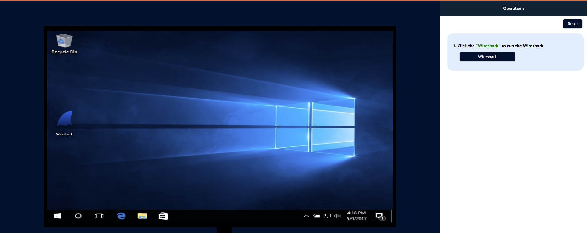
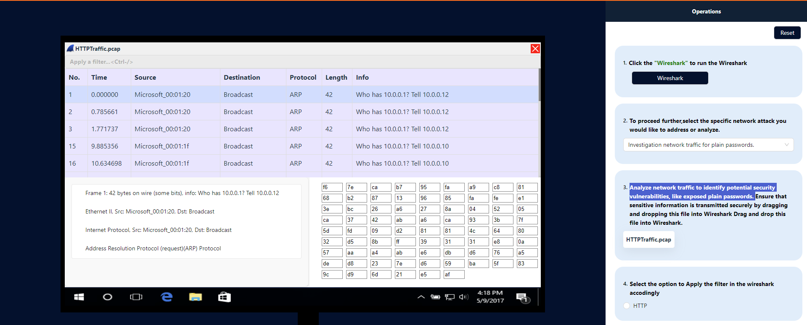
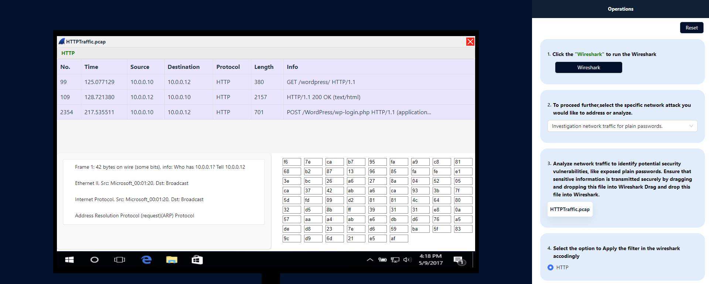

### Procedure

Wireshark is widely used by network administrators, security professionals, developers, and researchers for various purposes, including network troubleshooting, protocol analysis, security auditing, malware analysis, and network forensics. 

Analyze incoming and outgoing packets (pcap files) and to understand  different network attacks. 

<li> <b>Step-1 Click the "Wireshark" to run the Wireshark</b></li>

<li> <b>Step-2 To proceed further,select the specific network attack you would like to address or analyze.</b></li>

<li><b>Step-3 Analyze network traffic to identify potential security vulnerabilities, like exposed plain passwords. </b></li>

<li><b>Step-4 Select the option to Apply the filter in the wireshark accodingly</b></li>

Similarly, choose the specific network attack you want to investigate or analyze,from (step2) and then repeat the process accordingly
